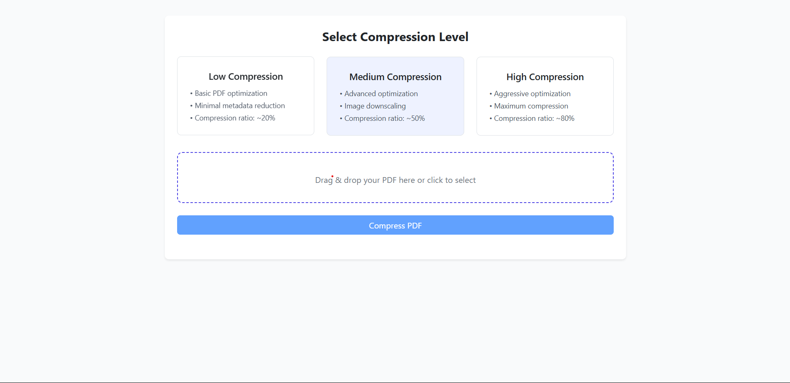

# 📄 PDF Compression

Welcome to **PDF Compression**, a lightweight and efficient tool to reduce the size of PDF files for easier storage and sharing. This project demonstrates PDF compression using **Python**, **Flask**, and libraries like **PyPDF2** and **Pillow**.

---

## 🚀 Features

- 📉 Compress PDF files with different compression levels (Low / Medium / High)
- ⚡ Fast and efficient file processing
- 📂 Upload and download compressed PDFs
- 🖥️ Clean and responsive web interface using Bootstrap
- 🛡️ Basic validations for file type and size

---

## 🛠️ Tech Stack

| Technology | Description                          |
| ---------- | ------------------------------------ |
| Python     | Core backend logic                   |
| Flask      | Lightweight web framework            |
| PyPDF2     | PDF manipulation                     |
| Pillow     | Image compression inside PDFs        |
| Bootstrap  | Frontend framework for responsive UI |
| HTML/CSS   | Structure and styling                |
| JavaScript | Basic interactivity                  |

---

## 📸 Screenshots

<div align="center">
    
</div>

---

## ⚙️ Installation

1️⃣ Clone this repository:

```bash
git clone https://github.com/Divyansh3105/PDF-Compression.git
```

2️⃣ Navigate into the project folder:

```bash
cd PDF-Compression
```

3️⃣ Install the required packages:

```bash
pip install -r requirements.txt
```

4️⃣ Run the Flask app:

```bash
python app.py
```

---

## 🌐 Usage

- Open your browser and go to `http://127.0.0.1:5000/`
- Upload a PDF, select a compression level, and download the compressed file.

---

## 🤝 Contribution

Pull requests are welcome! Feel free to fork the repository and submit improvements.

---

## 📜 License

This project is licensed under the **MIT License**.

---

## 🔗 Links

- [🔗 GitHub Repo](https://github.com/Divyansh3105/PDF-Compression)

## Contact

- 📧 Email: divyanshgarg3105@gmail.com
- 🌐 GitHub: [@Divyansh3105](https://github.com/Divyansh3105)
